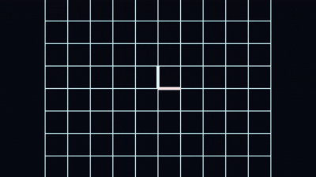
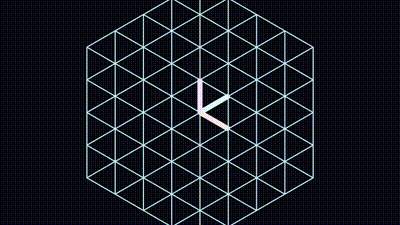
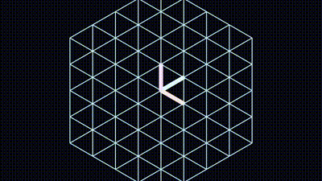

# 🌌 Linear Algebra Visual Engine Series
### *Simulation Architect Path: Phase 1*

> *"I like building from first principles: prove the idea in code, then make it visual enough to teach."*

---

## 🏗️ The Engines

### 01. LA-Visual-Engine

<table width="100%">
<tr>
<td width="50%">

</td>
<td width="50%">

</td>
</tr>
</table>

> **Proof of Concept:** Vectors aren't just lists of numbers; they are spatial directions that can be manipulated and scaled.
> 
> *First Principles:* A foundational engine establishing the isometric continuous coordinate space, drawing vectors and basic transformations dynamically.

**🔗 [Explore the Physics Engine & Source Code](https://github.com/divyanshailani/LA-Visual-Engine)**

---

### 02. LA-Visual-Engine-3D

<table width="100%">
<tr>
<td width="50%">

</td>
<td width="50%">

</td>
</tr>
</table>

> **Proof of Concept:** A matrix is a linear transformation of space, uniquely determined by where it sends the basis vectors î, ĵ, and k̂.
>
> *First Principles:* Animates a full 3D space lattice morphing under any $3 \times 3$ transformation matrix, proving linearity visually.

**🔗 [Explore the Physics Engine & Source Code](https://github.com/divyanshailani/LA-Visual-Engine-3D)**

---

### 03. Basis-Translator-3D

<table width="100%">
<tr>
<td width="50%">

</td>
<td width="50%">

</td>
</tr>
</table>

> **Proof of Concept:** The same physical vector has different coordinates depending on your chosen coordinate system (basis).
>
> *First Principles:* Overlaps two entire coordinate spaces. Proves that $A \cdot x = \text{new basis coordinates}$ while the physical "anchor" vector never actually moves.

**🔗 [Explore the Physics Engine & Source Code](https://github.com/divyanshailani/Basis-Translator-3D)**

---

### 04. Cramers-Rule-3D

<table width="100%">
<tr>
<td width="50%">

</td>
<td width="50%">

</td>
</tr>
</table>

> **Proof of Concept:** Solving a linear system is finding the ratio of transformed volumes.
>
> *First Principles:* Visually proves Cramer's Rule by calculating the determinant as the volume of a parallelepiped, showing how swapping columns alters the 3D volume proportionally.

**🔗 [Explore the Physics Engine & Source Code](https://github.com/divyanshailani/Cramers-Rule-3D)**

---

### 05. Eigenvector-Explorer-3D

<table width="100%">
<tr>
<td width="50%">

</td>
<td width="50%">

</td>
</tr>
</table>

> **Proof of Concept:** Eigenvectors are the specific axes of space that remain completely stable during a transformation, with eigenvalues being their stretch factor.
>
> *First Principles:* Scans a transformation, identifies real eigenvectors, and visualizes them as glowing axes that only scale along their own line while the rest of space morphs around them.

**🔗 [Explore the Physics Engine & Source Code](https://github.com/divyanshailani/Eigenvector-Explorer-3D)**

---

## 🛠️ Tech Stack & Methodology
- **Python 3.11+ / NumPy**: The logic brain and math engine.
- **Blender 5.0+ (`bpy`)**: The cinematic rendering engine.
- **Architecture**: 2-Phase pipeline (Phase 1: Math Verification → Phase 2: Blender Scene Generation).

## 🚀 The Next Phase
Moving from pure mathematics to physics: 
**Project 6A — Solar System Simulator** (N-body gravity, Velocity Verlet integration, NASA JPL datasets).